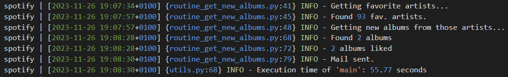
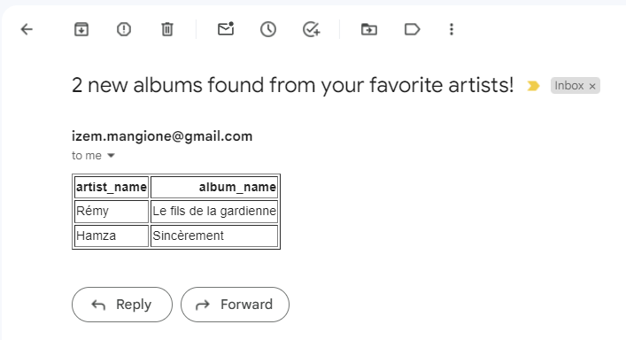
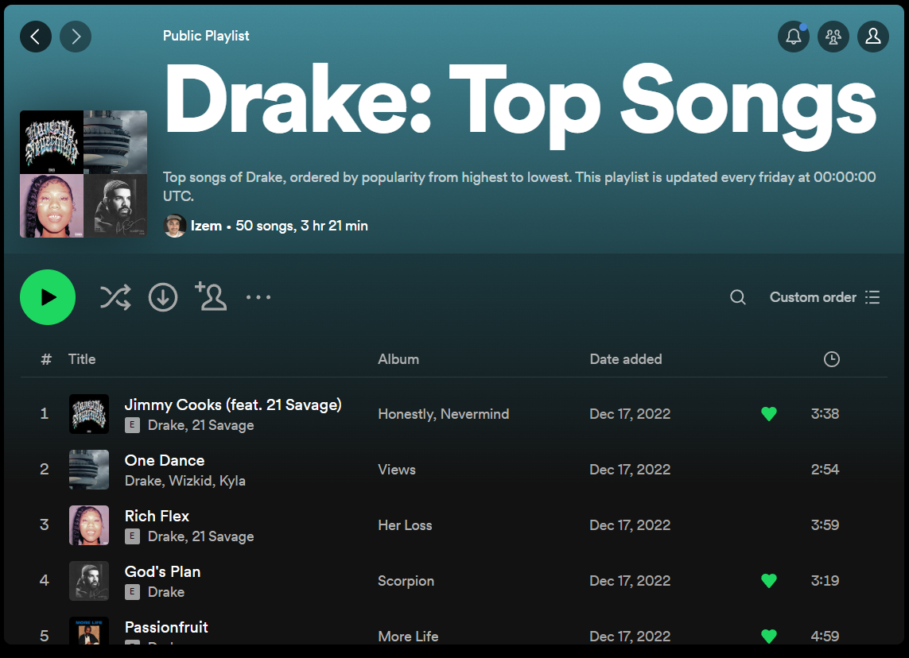

# Spotify Routines
> Routines to enhance my Spotify user experience

As an avid music listener, I found certain features lacking in Spotify. Consequently, I took the initiative to create them myself.

## Routine #1: update_release_radar (running every Friday)
Release Radar is a native Spotify playlist updated every Friday, intended to help users "catch all the latest music from the artists you follow." However, not all the new songs from the artists I follow were appearing in this playlist. Therefore, I developed a program to rectify this issue.

When running `routine_update_release_radar.py`, the program retrieves songs released by the artists I follow on Spotify within a specific date range (by default, from 6 days ago up to today's date) and updates a playlist in my library by adding these newly discovered songs.

Here, you can observe the creation of the playlist:

Furthermore, you can verify that the playlist indeed includes the new songs (the program adds songs only if they are not already in my official Spotify Release Radar, preventing redundancy).

## Routine #2: get_new_albums (running every Friday)
Spotify lacks a built-in feature to send notifications whenever an artist I follow releases a new album. To address this, I developed a program to handle notifications for me.

Upon executing `routine_get_new_albums.py`, the program scans all the artists I follow on Spotify, checking if any of them have released a new album within a specific date range (defaulting from 6 days ago up to today's date).

Upon detecting new albums, the program sends me an email notification.

## Routine #3: update_top_songs_playlists (running every Monday)

Spotify curates 'This Is' playlists for major artists, compiling their biggest hits into a single playlist ([example with 'This is Drake'](https://open.spotify.com/playlist/37i9dQZF1DX7QOv5kjbU68?si=a55ef8b8b5dc4033)). While I'm uncertain about how these playlists are assembled, I've noticed occasional inclusion of peculiar older songs. As a result, I developed a program to gather the 50 most popular songs by a given artist and compile them into a playlist.

Upon executing `routine_update_top_songs_playlists.py`, the program fetches all artists I follow on Spotify. For each artist, it retrieves their top 50 songs based on popularity (leveraging the 'popularity' field in Spotify's API) and updates the corresponding playlist. Prior to updating, the playlist needs to be initially created using `routine_create_top_songs_playlist.py`.

Here's an example of a 'Top Songs' playlist for Drake:

