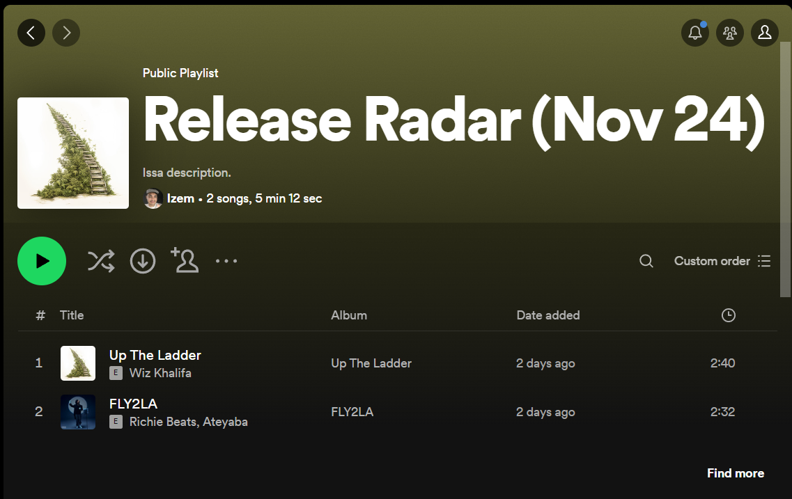

# Spotify New Releases!
> Getting new songs from my favorite artists.

## Context
As a big music listener, I was disappointed by the Spotify Release Radar. Indeed, this playslist is supposed to help you
"catch all the latest music from the artists you follow" but, in fact, not all the new songs from
the artists I follow were present in the playlist. Hence, I decided to make my own program that
does that for me!

## This is how it works
I simply execute the `main.py` file with a `--start` and a `--end` argument (corresponding to the date range I want the
program to search the new songs from, by defaut `--start=today-6 days`, `end=today`), in this example start is 
2021-11-27 and end is 2021-12-03. The program then parses the new songs that the artists I follow on Spotify released on
that date range, and then displays them in a pretty table. We can see that 17 new releases were found (a release
is either an album, a single or a featuring on which the artist I follow appears).

But not only the program displays the new songs, it also creates a new playlist in my library and add the songs to it!
Here you can see that the playlist has actually been created.

And here you can see that the playlist indeed contains the new songs (the program only adds the song if it is not in my
official Spotify Release Radar, to avoid redundancy).

Hope you liked it! See you.

## Contact
Izem Mangione – [@Izem0](https://github.com/Izem0) – izem.mangione@gmail.com  
Project Link: https://github.com/Izem0/spotify-new-releases
